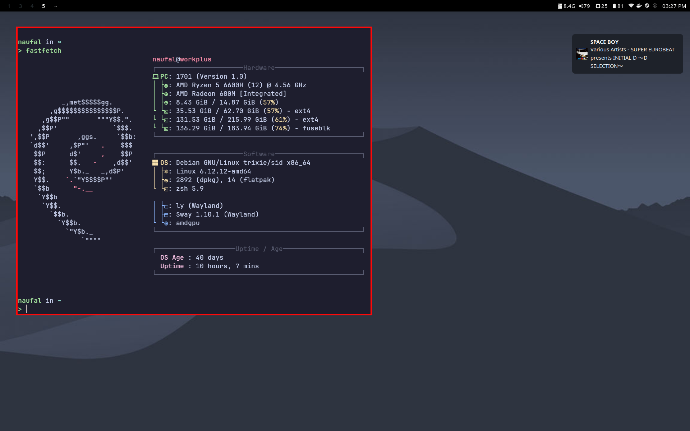

## Dependencies

- Sway
- Waybar
- Dunst
- Rofi/rofi-wayland
- Kitty
- Fish (optional)
- zsh
- Fastfetch
- Greenclip
- LXPolkit
- nm-applet
- blueman-applet
- autotiling
- feh
- grim
- slurp
- jq
- brightnessctl
- pavucontrol

## Installations

```sh
# Sway configuration
mkdir -p ~/.config/sway
cp -r .config/sway/* ~/.config/sway/

# Waybar configuration
mkdir -p ~/.config/waybar
cp -r .config/waybar/* ~/.config/waybar/

# Dunst configuration
mkdir -p ~/.config/dunst
cp .config/dunst/dunstrc ~/.config/dunst/

# Rofi configuration
mkdir -p ~/.config/rofi
cp .config/rofi/config.rasi ~/.config/rofi/

# Kitty configuration
mkdir -p ~/.config/kitty
cp .config/kitty/* ~/.config/kitty/

# Fish configuration
mkdir -p ~/.config/fish
cp -r .config/fish/* ~/.config/fish/

# Fastfetch configuration
mkdir -p ~/.config/fastfetch
cp .config/fastfetch/config.jsonc ~/.config/fastfetch/

# Nano configuration
mkdir -p ~/.config/nano
cp .config/nano/nanorc ~/.config/nano/

# QT5ct configuration
mkdir -p ~/.config/qt5ct
cp -r .config/qt5ct/* ~/.config/qt5ct/

# QT6ct configuration
mkdir -p ~/.config/qt6ct
cp -r .config/qt6ct/* ~/.config/qt6ct/

# Systemd configuration
sudo cp etc/systemd/logind.conf /etc/systemd/

# /etc/ configuration
sudo cp etc/ly/config.ini /etc/ly/
sudo cp etc/systemd/logind.conf /etc/logind

# zsh configurations
cp .zshrc ~/

# Reload sway
swaymsg reload
```

## Screenshot


